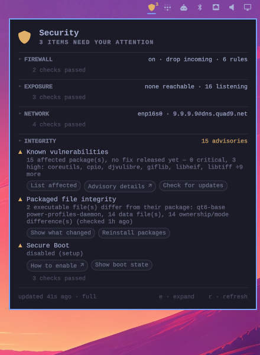
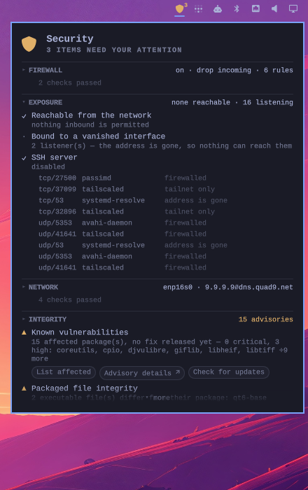

# Omarchy Security

A bar widget that answers one question at a glance: *is anything about this
machine's security worth my attention right now?*

The shield takes the colour of the worst thing currently true. Click it and
the panel tells you what that thing is — and offers to fix it.



**No setup, no privileges.** Install it and it works.

## What it checks

| | |
|---|---|
| **Firewall** | ufw on/off, default incoming policy, rule count |
| **Exposure** | every listening socket, correlated against the ufw ruleset |
| **Network** | Wi-Fi encryption, DNS resolver and DoT, gateway MAC changes |
| **Integrity** | Arch security advisories, modified packaged files, Secure Boot, disk encryption, pending kernel reboot |

## Install

```bash
omarchy plugin add https://github.com/casea1/omarchy-security.git --enable
```

That's it. Nothing to configure and nothing to run as root.

## The exposure check

A process listening on `0.0.0.0` is unremarkable. A process listening on
`0.0.0.0` **that your firewall permits** is reachable by anyone on the
network — and that is the distinction no single command gives you.

Expand the section for the full table. Sockets bound to your tailnet, to a
container bridge, or to an address the machine no longer has are labelled as
such instead of being counted as exposure.



## Fixes are buttons

Findings do the thing rather than telling you what to type. Commands open in
a terminal so `sudo` can prompt and the output stays readable; the window
waits for a keypress, so a command that fails is still legible. Buttons
marked `↗` open a browser.

| Finding | Buttons |
|---|---|
| Known vulnerabilities | List affected · Advisory details ↗ · Update system |
| Packaged file integrity | Show what changed · Reinstall packages |
| Secure Boot disabled | How to enable ↗ · Show boot state |
| ufw off / incoming allowed | Enable firewall · Deny incoming |
| Something reachable | Show ufw rules · Show listeners |
| SSH server enabled | Disable SSH server · Show SSH config |
| Gateway MAC changed | Accept new gateway · Show ARP table |

## Using the panel

The panel shows **problems, not inventory**. Passing checks fold into one
line per section; click a header to see them. Counts and facts live in the
section summary rather than taking a row each.

| Input | Action |
|---|---|
| left click | open / close |
| right or middle click | re-run the collectors |
| click a section header | expand or collapse it |
| `e` | expand or collapse everything |
| `r` | re-run the collectors |
| `esc` | close |

## Settings

Set these inline on the widget's entry in `~/.config/omarchy/shell.json`.

| Key | Default | Meaning |
|---|---|---|
| `showBadge` | `true` | Count of warnings beside the shield |
| `staleAfterSec` | `300` | Age at which the snapshot is treated as stale |
| `warnColor` | `""` | Override the amber used for warnings |
| `showLocalListeners` | `false` | Include loopback sockets in the expanded exposure table |

## Optional: full checks

Everything above works unprivileged. Two things need root, and the panel
offers them behind an **Enable full checks** button that asks for your
password once:

- **Process names for other users' sockets.** `ss` will not name them otherwise.
- **A complete file-integrity sweep.** A user cannot read every packaged file;
  those are counted as *unreadable*, never as *unchanged*.

It installs two read-only collectors on systemd timers, a polkit rule scoped
to `start` on exactly those two units for `wheel`, and `arch-audit`. Run it
by hand with `sudo system/install.sh` if you prefer.

## Remove

```bash
omarchy plugin remove io.github.casea1.security
```

If you enabled full checks, remove the privileged half **first**, while the
script is still on disk:

```bash
sudo ~/.config/omarchy/plugins/io.github.casea1.security/system/uninstall.sh
```

Too late? By hand:

```bash
sudo systemctl disable --now omarchy-security-collect.timer omarchy-security-audit.timer
sudo rm -f /etc/systemd/system/omarchy-security-{collect,audit}.{service,timer} \
           /usr/local/bin/omarchy-security-{collect,audit} \
           /etc/polkit-1/rules.d/49-omarchy-security.rules
sudo systemctl daemon-reload
sudo rm -rf /run/omarchy-security /var/lib/omarchy-security
```

## How it works

The widget is unprivileged QML that runs two collector scripts itself and
reads the JSON they write. Opening the panel cannot produce an
authentication prompt, because there is nothing to authenticate.

That works because almost nothing here needs privilege:

- `ufw status` refuses to run as anyone but root, but every file it reads is
  world-readable — and the `### tuple ###` lines in `/etc/ufw/user.rules` are
  a *better* source than its output, with application profiles already
  expanded into concrete ports.
- The advisory database is a public JSON document and `vercmp` ships with
  pacman, so the CVE check is a join anyone can compute. It was cross-checked
  against `arch-audit` and reports the identical package set.

Install the optional half and root does the same work on a timer instead;
the panel reads whichever snapshot is newer.

Two rules the collectors follow:

- **A check that could not run reports `unknown`, never `ok`.** A security
  widget that shows green because it failed to look is worse than none.
  Stale data degrades the shield the same way.
- **Severity tracks what you can act on.** An advisory with a published fix
  you have not installed is a failure. One upstream has not fixed yet is a
  warning — turning the icon red for something nobody can install helps no one.

Action commands are composed inside the collectors from a fixed vocabulary,
never assembled from panel state, and package names interpolated into one are
filtered to `[A-Za-z0-9@._+-]` first.

## Licence

MIT
